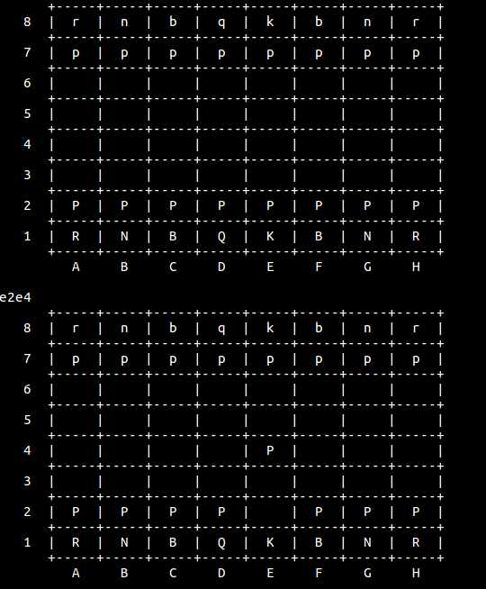

# ChessAI
Chess AI in C++ using minimax with alpha-beta pruning

To Build and Run:

- Using CMake
    1. create separate build directory (e.g. `mkdir build`)
    2. `cd` to new directory
    3. `cmake ..`
    4. `make`
    5. `./ChessAI`
- Using Makefile
    1. `make`
    2. `./bin/chessAI`

To Play:

- A move command is given as a string of 4 characters
- To create a move command concatenate the `coordinates` of where the piece starts and where it ends
	- For example, the command `e2e4` will move the King's Pawn 2 spaces forwards
- The AI will respond accordingly
- If at any time you wish to quit, type `q` or `quit` in-place of a move command

Example:

